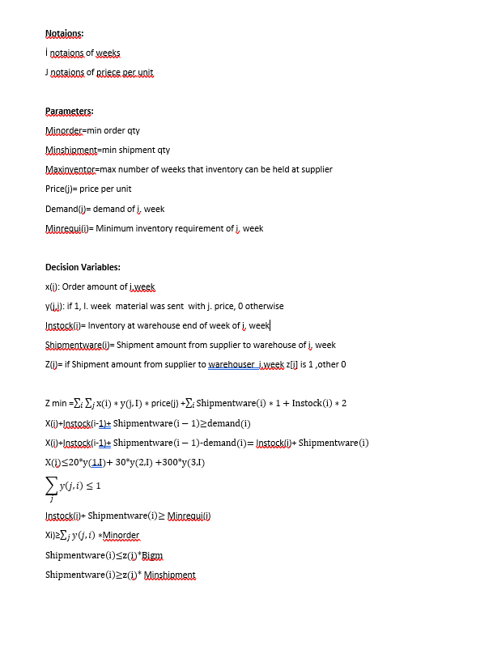

# Freelancer Project
## capacity-problem-with-gurobi

```
The solution of the minimum demand meeting problem according to the capacity of the suppliers by 
using gurobi solvent. 
```

### Project description
```
Our aim in the project is to meet the demand with as little cost as possible.

For this purpose, when we buy materials above a certain quota from suppliers, a discount is applied, but 
there is a stock cost for every product that 
we cannot consume. we can also keep our stocks 
in our own warehouse and in the supplier's warehouse.


```
### Mat model of problem





# Results


```
As a result of the model written, the least costly ordering numbers were found every week.
```


